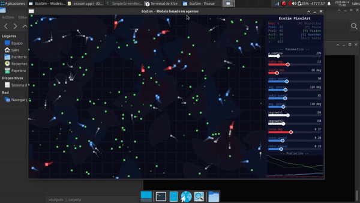
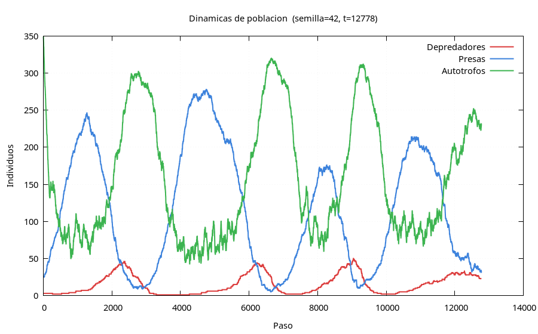

# EcoSim - Modelo Basado en Agentes 

Simulación ecológica de tres niveles tróficos: depredadores, presas y autótrofos (hierba), con interfaz gráfica interactiva construida con C++ y FLTK.

<!--  -->


## Autor
- Matías Ezequiel Hernández Rodríguez
- Email: matiasehernandez@gmail.com

## Estructura del proyecto

```
EcoSim/
|-- src/
|   |-- main.cpp (Punto de entrada)
|   |-- grass.cpp (Clase Grass: autótrofos)
|   |-- agent.cpp (Clase base Agent)
|   |-- prey.cpp (Clase Prey)
|   |-- predator.cpp (Clase Predator)
|   |-- popgraph.cpp (Historial de poblaciones)
|   |-- sim.cpp (Lógica principal)
|
|-- include/
|   |-- ecosim.h
|
|-- build/ (Objetos compilados)
|-- bin/ (Ejecutable)
|-- Makefile
|-- README.md
```

## Dependencias

- Compilador con soporte C++ (`g++`).
- FLTK 1.3 (`libfltk-dev`).
- Gnuplot (para generar gráficas PNG al guardar)

### Instalación en Ubuntu/Debian

```bash
sudo apt install g++ libfltk1.3-dev gnuplot
```

## Compilar y ejecutar

```bash
make # Compila y genera bin/ecosim
make run # Compila (si es necesario) y ejecuta
make clean # Elimina build/ y bin/ecosim
```

## Controles

| Tecla | Acción |
|-------|--------|
| `R`   | Reiniciar simulación (semilla fija = 42) |
| `P`   | Pausa / reanudar |
| `V`   | Mostrar / ocultar conos de visión |
| `S`   | Guardar reporte en `output/` |
| `Esc` | Salir |

Los mismos controles están disponibles como botones en el panel lateral.

## Parámetros ajustables (sliders)

| Parámetro | Rango | Descripción |
|-----------|-------|-------------|
| `p_captura` | 0.05 – 1.0 | Probabilidad de captura exitosa |
| `radio dep.` | 40 – 250 | Radio de visión del depredador |
| `angulo dep.` | 10 – 360 | Ángulo del cono de visión del depredador |
| `radio presa` | 30 – 200 | Radio de visión de la presa |
| `angulo presa` | 10 – 360 | Ángulo del cono de visión de la presa |
| `regrowth` | 50 – 400 | Pasos hasta que la hierba vuelve a crecer |
| `costo dep.` | 0.05 – 0.8 | Costo energético por movimiento del depredador |
| `costo presa` | 0.05 – 0.6 | Costo energético por movimiento de la presa |

## Salida (tecla S)

Al guardar se crea la carpeta `output/` con:

- `ecosim_<paso>.txt`: parámetros y poblaciones finales.
- `ecosim_<paso>_hist.csv`: historial completo de poblaciones.
- `ecosim_<paso>.gp`: script Gnuplot.
- `ecosim_<paso>_dinamicas.png`: series temporales.
- `ecosim_<paso>_fase_dep_presa.png`: diagrama de fase depredador/presa.
- `ecosim_<paso>_fase_presa_aut.png`: diagrama de fase presa/autótrofo.
- `ecosim_<paso>_fase_dep_aut.png`: diagrama de fase depredador/autótrofo.

## Dinámica de la simulación

Los modelos basados en agentes generan comportamientos complejos a partir de reglas locales simples.  
En EcoSim podemos observar distintos escenarios, y en algunos de ellos, como se muestra a continuación, conviven autótrofos, presas y depredadores, dando lugar a dinámicas poblacionales similares a las descritas por el modelo de Lotka-Volterra.



## Licencia

Este proyecto está bajo la licencia MIT. Ver el archivo LICENSE para más detalles.
